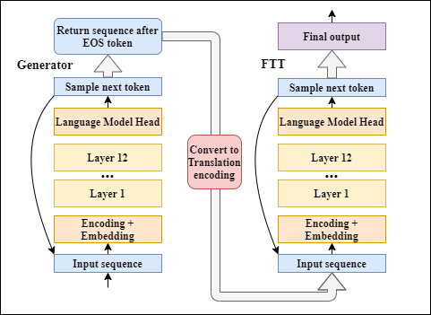

# On-grammar-improvements-of-GPT-2-generation

This repository includes the complete code for the paper "On improving GPTs language generation through grammar error rate reduction". The purpose of this repository is to make the
 conducted experiments reproducable, give additional insights and inspire future research.




## Getting Started

This repository includes the following things: 

  - Documentation of the Dataset building process
  - Finetuning, Grammar Correction, and Generation scripts that were used during this research project
  - Documentation of the complete evaluation process
  - A mountain of generated samples that was used for evaluation
  - Documentation of the model combination evaluation
  - Documentation of example generation for our paper.


## Build on

* [HuggingFace -Transformers](https://github.com/huggingface/transformers)
* [language-check](https://pypi.org/project/language-check/)

### Installation

To install dependencies simply run

```
pip install -r requirements.txt
```

To rebuild the missing empty folders for external resources and saves simply run

```
python create_empty_folders.py
```


You should be good to go. 


  
  
## The following external resources should be added in order to retrace all steps: 

- LAMBADA data files should be extracted to the LAMBADA folder (downloadable from https://wiki.cimec.unitn.it/tiki-index.php?page=CLIC)
- The GPT-2 generation datasets should be extracted to the original_data folder (downloadable from https://github.com/openai/gpt-2-output-dataset). For the purpose of this paper, only the small-117M datasets are needed.
- The model checkpoints are needed to retrace everything. If needed they are available by contacting Gideon-Stein. 


## Finetuning scripts usage:
 ```
 python run_lm_finetuning_frozen_3.py --output_dir=model_save/test --model_type=gpt2 --model_name_or_path=gpt2 --do_train --train_data_file=train.txt 
 python run_generation_edited.py  --output_dir=model_save/test --model_type=gpt2 --model_name_or_path=gpt2 --do_train --train_data_file=data_files/train.txt

 ```

## Generation scripts usage:
 ```
 python transgenerator_translation.py --model_path=../trained_models/test/pytorch_model.bin --text_path ../build_data/test.txt --n_data 1000 --save_path test.p
 python run_generation_edited.py  --model_name_or_path=model_save/test/pytorch_model.bin --save_name test 
```
  Parameters can be added and changed accordingly to the script.


## Grammar correction scripts usage:
 ```
python grammar_parser_json.py --path data/small-117M.train.jsonl --save_replace True --name test
python grammar_parser_txt.py --path base.txt --save_replace True --name test

 ```
 

 ## Authors

* **Gideon Stein** - *Initial work* - [Github](https://github.com/Gideon-Stein)


